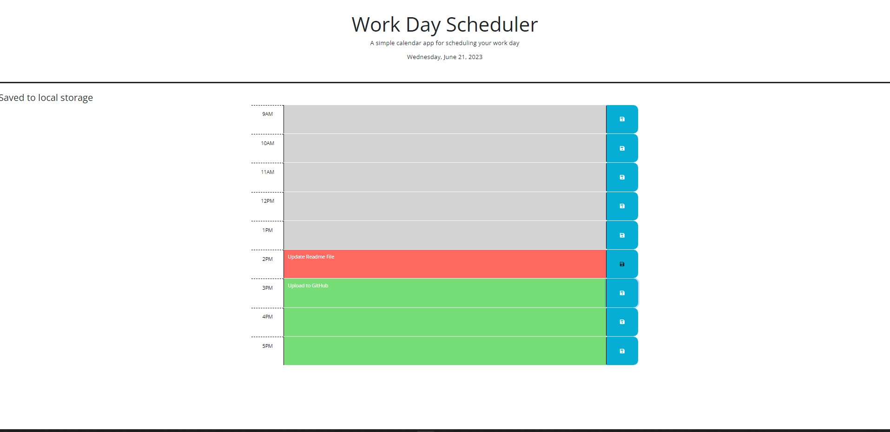

# Module 5 challenge - Third-Party APIs: Work Day Scheduler

## Criteria
1) open the planner, the current day is displayed at the top of the calendar
2) scroll down and presented with timeblocks for standard business hours of 9am and 5pm
3) view the timeblocks for that day, each timeblock is color coded to indicate whether it is in the past, present, or future
4) click into a timeblock, can enter an event
5) click the save button for that timeblock
6) text for that event is saved in local storage
7) refresh the page, the saved events persist
8) Add message (Saved to local storage) after click save button.

## Completed:
1) I have completed the current dat to be display at the top of the calendar
2) I have completed timeblocks between business hours 9am and 5pm
3) I have completed timeblock in color coded to indicate past, present, or future
4) User can enter an event into time block
5) I have completed save function in local storage when the button click
6) Text saved in the local storage
7) refresh the page and saved events still persist.
8) I have added message ((Saved to local storage) ) after click save button (2 seconds display)

## Deployment
URL: TBA
GITHUB: https://github.com/csetiawan88/workdayscheduler

## Screen shot:

